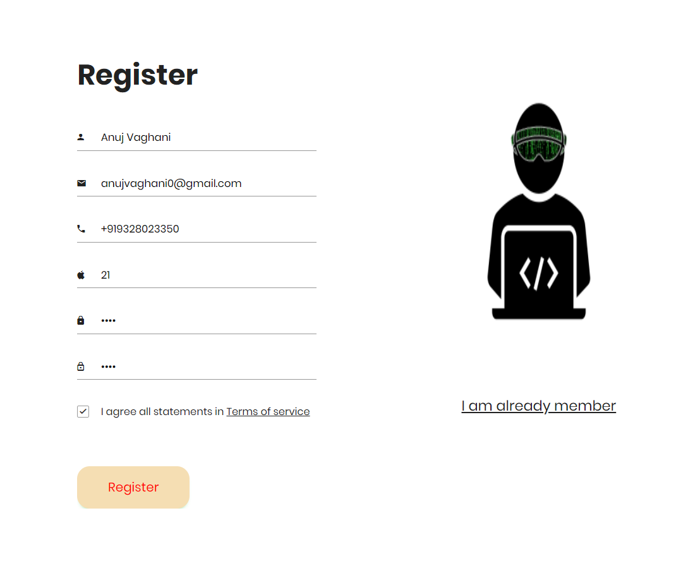
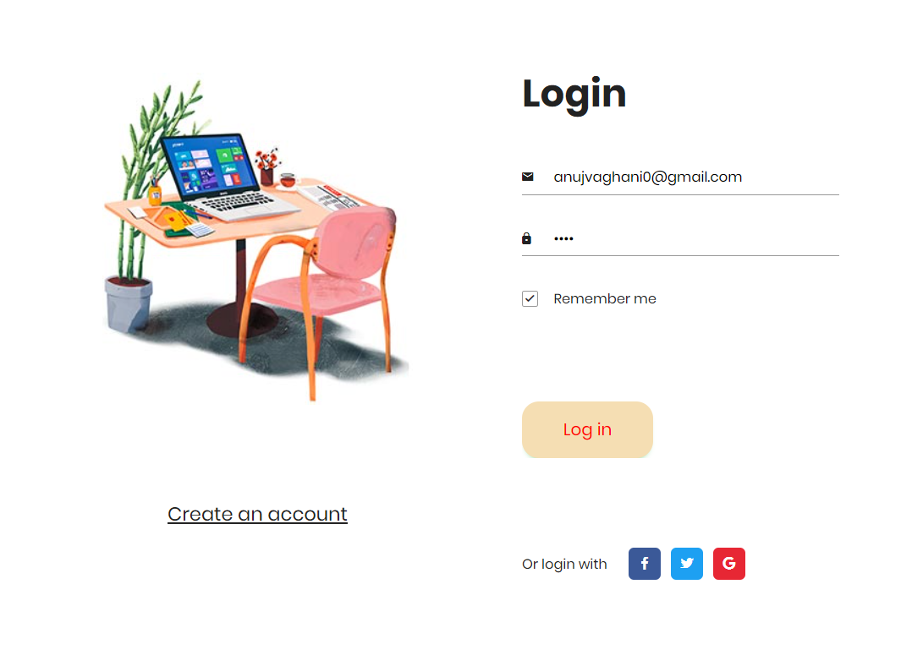

<h1 align="center">
    <b>User Registration & Login systems in<br> Node.js using MongoDB </b> 
<br>
</h1>


<p align="center">
  <a href="/LICENSE"></a>
</p>


## What is this for?
This is a Simple User Registration & Login systems app done with Node.js Framework using MongoDB(Atlas) as the data store, Express as the routing system, Body-parser as the parser for webpage, Express-session used  to track the user's session and of course Mongoose to make interacting with Mongo from Node easy.

## Getting Started

## Running the tests

### •Registration Form:
Allows the user to register their account by filling their Email,PhoneNumber,Age,Password.



### •Login Form:
If the user has been registered on the app, can login by passing the credentials.


### DataBase:
Here we use **[MongoDB Atlas(Cloud)](https://www.mongodb.com/cloud/atlas)** as the database. Here we have two collection created, named as:
- users.
- sessions.

A Collection(**Users**) is populated with the user's credentials.


<br>
<br>
<br>

## Prerequisites
Tools that we need to run this app:

- ***[Node.js](https://nodejs.org/en/)***
- ***[Node Package Manager](https://www.npmjs.com/get-npm)***
- ***[MongoDB (Atlas)](https://www.mongodb.com/cloud/atlas)***

## Installing
```
npm install
```


## To Run the App
```
node server.js
```

The server will start Running on
+ http://localhost:9000/


## Author

| Author                | Profile Link                                       |
| --------------------- | :------------------------------------------------- |
| **Guru HariHaraun N** | **[Guru Roxz](https://github.com/anujvaghani0)** |

<p align="center">
  Made with ❤️ by <a href="https://github.com/anujvaghani0">Anuj Vaghani</a>
</p>
